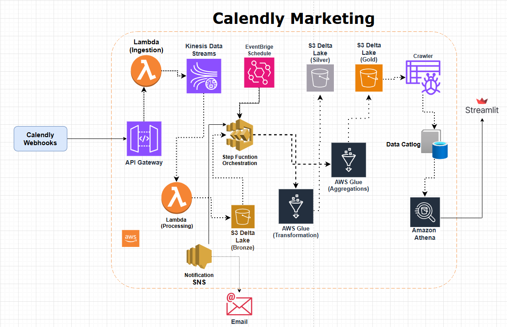
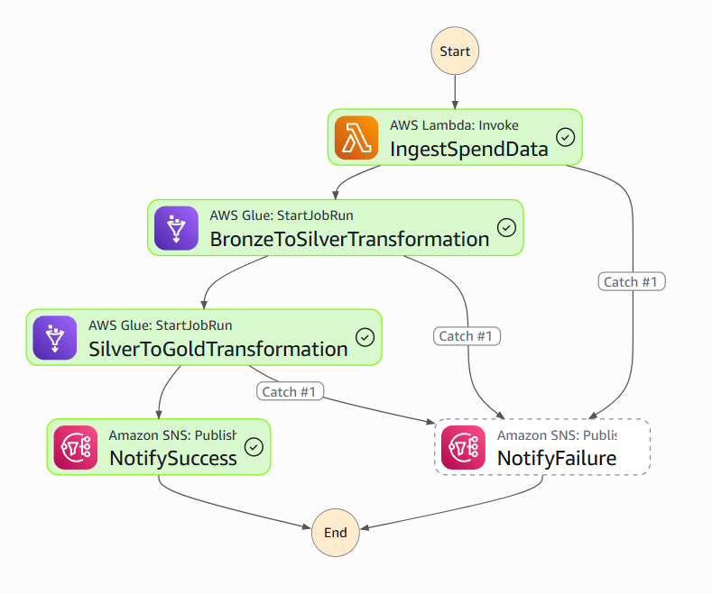

# calendly-marketing

## Calendly Marketing Architecture



## Step Function Orchestration



## 🔧 Component Configuration Summary

### Infrastructure Components

| Component | Name | Configuration |
|-----------|------|---------------|
| __API Gateway__ | 27tr2hk84i | REST API, Regional |
| __Lambda (Webhook)__ | calendly-webhook-receiver-prod | Python 3.11, 256MB, 30s timeout |
| __Lambda (Processor)__ | calendly-kinesis-processor-prod | Python 3.11, 256MB, 60s timeout |
| __Kinesis Stream__ | calendly-events-stream-prod | 1 shard, 24h retention |
| __Step Functions__ | calendly-etl-orchestrator-prod | Standard workflow |
| __Glue Job 1__ | calendly-bronze-to-silver-prod | 2x G.1X, Glue 4.0, Delta Lake |
| __Glue Job 2__ | calendly-silver-to-gold-prod | 2x G.1X, Glue 4.0, Delta Lake |
| __S3 Bronze__ | calendly-bronze-prod-635374934580 | Standard storage |
| __S3 Silver__ | calendly-silver-prod-635374934580 | Standard storage, Delta Lake |
| __S3 Gold__ | calendly-gold-prod-635374934580 | Standard storage, Delta Lake |
| __Glue Database__ | calendly_analytics_db | 7+ tables |
| __ECS Cluster__ | calendly-dashboard-cluster-prod | Fargate |
| __ECS Service__ | calendly-dashboard-prod | 1 task, 0.5 vCPU, 1GB RAM |
| __ALB__ | calendly-dashboard-alb-prod | Internet-facing |
| __SNS Topic__ | calendly-pipeline-notifications-prod | Email/SMS subscriptions |
| __EventBridge Rule__ | calendly-daily-etl-prod | cron(0 2 * * ? *) |

---


## End-to-End Data Flow

Let's trace a single booking from webhook to dashboard:

### T0: Booking Created
````
User books meeting via Calendly
  ↓
Calendly triggers webhook
  ↓
POST https://27tr2hk84i...amazonaws.com/prod/webhook
````

### T1: API Gateway
```
API Gateway receives request
  ↓
Validates request format
  ↓
Invokes Lambda webhook receiver
```

### T2: Webhook Receiver Lambda
```
Lambda parses payload
  ↓
Validates event type = "invitee.created"
  ↓
Checks event_type_url = "d639ecd3..." (Facebook)
  ↓
Extracts marketing_channel = "facebook_paid_ads"
  ↓
Stores raw webhook in S3 (audit)
  ↓
Sends to Kinesis stream
  ↓
Returns 200 OK to Calendly
```

### T3: Kinesis Processor Lambda
```
Kinesis triggers Lambda (batching delay)
  ↓
Lambda processes batch of 1-100 records
  ↓
Flattens JSON structure
  ↓
Writes to Bronze:
  s3://bronze/calendly_events/
    channel=facebook_paid_ads/
      date=2026-02-20/
        event-49671-123-456.json
```

### T4 to 2 AM: Data at Rest
```
Data sits in Bronze layer
  ↓
Waiting for daily ETL run
```

### 2:00 AM: EventBridge Trigger
```
EventBridge rule fires
  ↓
Starts Step Functions execution
```

### 2:00-2:03 AM: Bronze to Silver
```
Glue job reads Bronze JSON
  ↓
Parses and cleans data
  ↓
Writes Delta Lake table to Silver
  ↓
Registers in Glue Catalog
```

### 2:03-2:08 AM: Silver to Gold
```
Glue job aggregates Silver data
  ↓
Calculates 5 business metrics
  ↓
Writes 5 Delta Lake tables to Gold
  ↓
Registers in Glue Catalog
```

### 2:08 AM: Notification
```
Step Functions completes
  ↓
SNS sends success email
  ↓
Team receives notification
```

### 9:00 AM: User Views Dashboard
```
User opens dashboard URL
  ↓
ALB routes to ECS task
  ↓
Streamlit executes Athena queries
  ↓
Athena reads Gold Delta tables
  ↓
Dashboard shows booking in charts
  ↓
User sees yesterday's booking!
```


## Silver Schema:
```
invitee_uri: string
invitee_email: string
invitee_name: string
invitee_first_name: string
invitee_last_name: string
invitee_status: string
invitee_timezone: string
invitee_phone: string
invitee_created_at: timestamp
invitee_updated_at: timestamp
invitee_canceled: boolean
invitee_rescheduled: boolean
event_name: string
event_status: string
event_start_time: timestamp
event_end_time: timestamp
event_created_at: timestamp
event_type: string
location_type: string
location_join_url: string
utm_campaign: string
utm_source: string
utm_medium: string
utm_content: string
utm_term: string
marketing_channel: string
booking_date: date
booking_year: int
booking_month: int
booking_day_of_week: string
booking_hour: int
processed_at: timestamp
```
## Gold mertics
```
booking_time_analysis
bookings_trend
channel_attribution
cost_per_booking
daily_bookings_by_source
```

## Strealimt Dashboard

http://calendly-dashboard-alb-prod-2005536559.us-west-1.elb.amazonaws.com/
